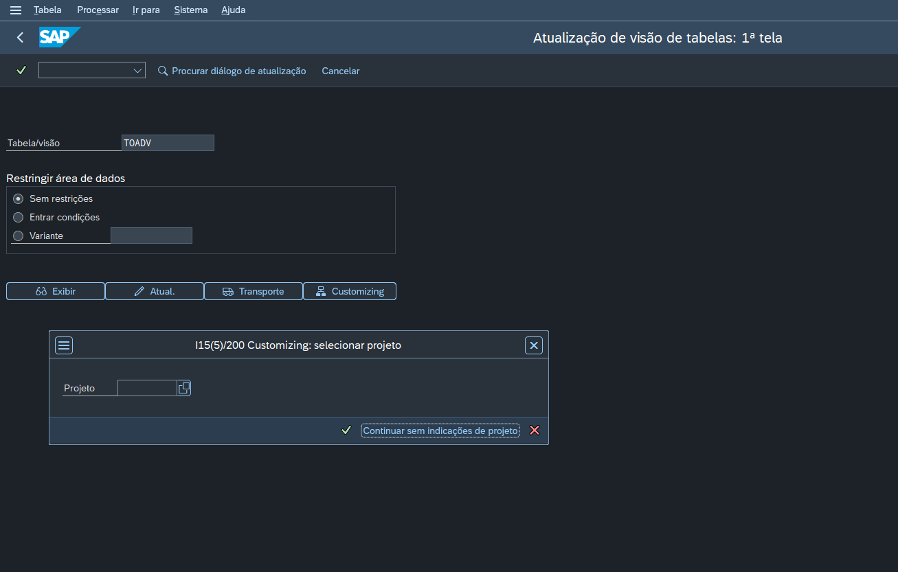
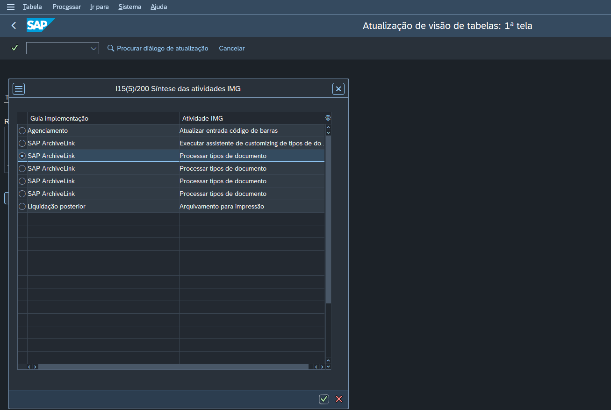
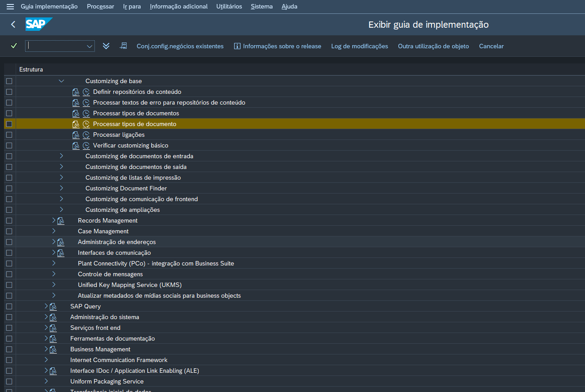
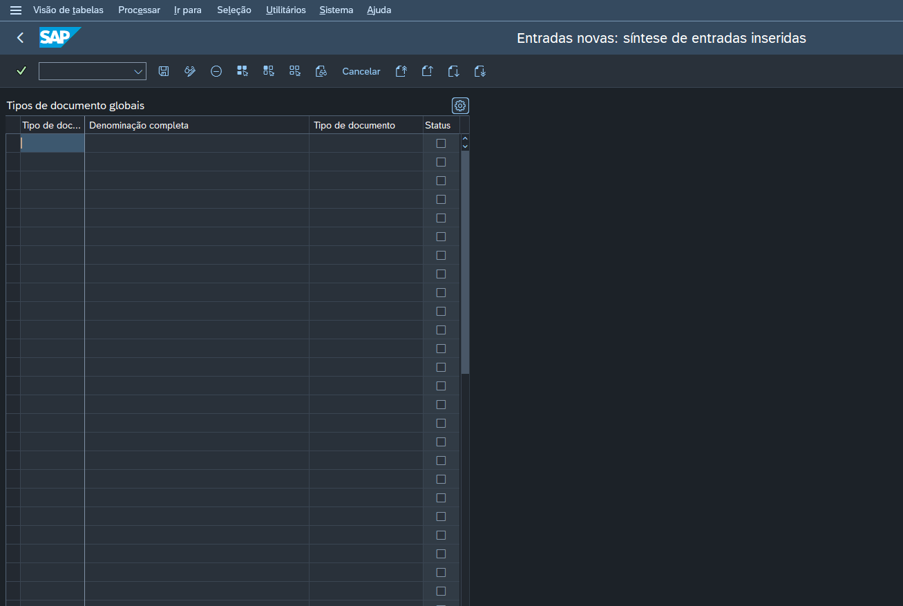

# Anexos
 Utilização de solução standard de anexos.

~~O Mumu que deveria fazer isso~~

Em construção.
Referenter a classe standard `CL_GOS_ATTACHMENTS`.
Eu acho que essa classe tambem pode ajudar com algumas cenas: `CL_GOS_SRV_ATTACHMENT_LIST`

> Importantes coisas aqui...

## Configuracão
Os objetos devem ser configurados para serem usados com o link. Para esta solução sera criado um objeto que atende mais de um tipo de documento.

### Transação
Adicionar o tipo de documento pela transação `TOADV`.

1. Ir a tcode `SM30` e entrar com a tabela e clicar em **Customizing** › **Continuar sem indicação do projeto**.

2. Escolher a opção  **SAP ArchiveLink** para *Processar tipos de documento*.

3. Depois, **Processar tipos de documento**.

4. Então, basta informar os campos solicitados e salvar em uma request os dados esperados.

### Transação

/nOAC3

.

ZJMP_TST
ZSAF